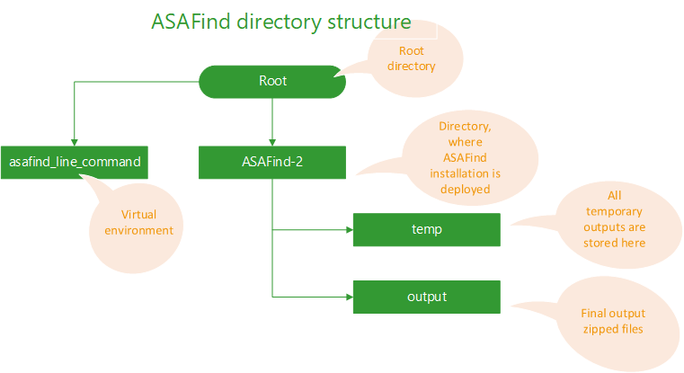

### 

### Download ASAFind to install locally

For local installation, a command line version of ASAFind can be downloaded from our GitHub repository:

<https://github.com/ASAFind/ASAFind-2>

### Installation steps

Using the GitHub function, you can either dowload the files as a zip archive, or you can clone the repository using the provided URL. ASAFind requires a Unix-based operating system like Linux (Ubuntu) or macOS. After download of the latest version, follow these installation steps on a command-line shell:

* Step into the directory where you want to make the installation e.g.:
    - cd /home/marta/asafind
* Make a clone of the GitHub (if git is installed: "git clone https://github.com/ASAFind/ASAFind-2.git"), or place the content of the downloaded zip archive in the folder. 
* Run the following commands:
    - python3 -m venv asafind\_command\_line 
    - . asafind\_command\_line/bin/activate
    - pip install --upgrade pip
    - pip install -r requirements.txt
* Now you are in a virtual environment named asafind\_command\_line. Here you can run the scripts or ask for help e.g.:
    - python3 S0\_ASAFind.py --help

### 
The installation procedure will create the environment asafind\_command\_line, activate it, install all required packages activate and create the subdirectries temp and output.

### ASAFind 2.0

The script S1\_ASAFind.py in the environment root directory performs the actual prediction. It is called from the script S0_ASAFind.py, which handles the options and generates the optional graphical output. Input data is a Fasta and a companion TargetP v.2.0 short format tabular output file, with the complete TargetP header (two lines starting with '#'). Some versions of SignalP/TargetP truncate the sequence names. SignalP-3.0 to 20 characters, and 4.0, 4.1 to 58 characters. Therefore, ASAFind only considers the first corresponding characters of the fasta name (and the first 90 in the case of TargetP 2.0), which must be unique within the file. Parts of the fasta name after that character are ignored. Additionally, the fasta name may not contain a '-' or '|'. This requirement is because SignalP/TargetP converts special characters in sequence names (e.g. '-' is changed to '\_'). ASAFind requires at least 7 aa upstream and 22 aa downstream of the cleavage site suggested by SignalP/TargetP. The basic output of ASAFind is a tab delimited table containing the results for each sequence in the FASTA input file. The results table, the log files, and if requested the graphical output are zipped and can be found in the folder 'output'. In the current version, graphical output can only be generated for predictions generated from TargetP 2 output. Please save the results in a different location; each new run of ASAFind will overwrite the content of the folder 'output'. Python >= 3.10 is required.

### python S0\_ASAFind.py --help

|  |  |
| --- | --- |
| usage: S0\_ASAFind.py | [-h] -f FASTA\_FILE -p SIGNALP\_FILE  [-s SIMPLE\_SCORE\_CUTOFF] [-t FASTA\_FILE\_WITH\_MOTIFS] [-w]  [-v1] [-ppc] [-s\_ppc SCORE\_CUTOFF\_PPC]  [-t\_ppc FASTA\_FILE\_WITH\_MOTIFS\_PPC] [-l]  [-my\_org MY\_ORGANISM] [-v] |

|  |  |
| --- | --- |
| -h, --help | Show this help message and exit |
| -f FASTA\_FILE, --fasta\_file FASTA\_FILE | Specify the input fasta FILE. |
| -p SIGNALP\_FILE, --signalp\_file SIGNALP\_FILE | Specify the input TargetP FILE. |
| -s SIMPLE\_SCORE\_CUTOFF, --simple\_score\_cutoff SIMPLE\_SCORE\_CUTOFF | Optionally, specify an explicit score cutoff, rather than using ASAFind's default algorithm, not compatible with option -v1. The score given here will not be normalized and therefore should be obtained from a distribution of normalized scores. |
| -t FASTA\_FILE\_WITH\_MOTIFS, --fasta\_file\_with\_motifs FASTA\_FILE\_WITH\_MOTIFS | Optionally, specify a custom scoring table. The scoring table will be normalized with the maximum score, which allows for processing of non-normalized as well as normalized scoring tables. |
| -w, --web\_output | Format output for web display. This is mostly useful when called by a web app. |
| -v1, --reproduce\_ASAFind\_1 | Reproduce ASAFind 1.x scores and results (non-normalized scores, if no custom scoring table is  specified, the original default scoring table generated without small sample size correction  will be used, not compatible with option -s). |
| -ppc, --include\_ppc\_prediction | Include prediction of proteins that might be targeted to the periplastidic compartment. |
| -t SCORE\_TABLE\_FILE, --score\_table\_file SCORE\_TABLE\_FILE | Optionally, specify a custom scoring table. The scoring table will be normalized with the  maximum score, which allows for processing of non-normalized as well as normalized scoring  tables. |
| -o OUT\_FILE, --out\_file OUT\_FILE | Specify the path and name of the output file you wish to create. Default will be the same as  the fasta\_file, but with a ".tab" suffix. |
| -s\_ppc SCORE\_CUTOFF\_PPC, --score\_cutoff\_ppc SCORE\_CUTOFF\_PPC | Optionally, specify an explicit score cutoff for the ppc protein prediction, if given, ppc  protein prediction will be included. The score given here will not be normalized and therefore should be obtained from a distribution of normalized scores. |
| -t\_ppc SCORE\_TABLE\_FILE\_PPC, --score\_table\_file\_ppc SCORE\_TABLE\_FILE\_PPC | Optionally, specify a custom scoring table for the ppc protein prediction, if given, ppc  protein prediction will be included. The scoring table will be normalized with the maximum  score, which allows for processing of non-normalized as well as normalized scoring tables. |
| -l, --logomaker | If chosen, the program will generate graphical output using logomaker, in .png and .svg formats. They will be included into the output compressed package. |
| -my\_org MY\_ORGANISM, --my\_organism MY\_ORGANISM | Specify the name of organism. |
| -v, --version | Show program's version number and exit. | |

### Usage

When using TargetP 2 output files, this example can be used for a test run using the supplied example files:

* python S0\_ASAFind.py -f example.fasta -p example_summary.targetp2 -l

The results are zipped and can be found in the folder 'output'. This command in the current version only works with TargetP 2 output. If you would like to use ASAFind in conjuction with SignalP 3-5, use this command instead:

* python S1\_ASAFind.py -f example.fasta -p SignalP5_example_output.txt

In this case, the result table can be found in the same directory from which the script is called (in this example the file name will be 'example.tab'), a log file with a summary can be found in the folder 'temp'. Example SignalP output files are also provided for SignalP 4.1 and SignalP 3, these can be used analogously.

If you use ASAFind in your research please cite our publication (Gruber et al., 2025, <https://doi.org/10.1111/tpj.70138>) as well as the appropriate publications for SignalP or TargetP:

* SignalP 5: Almagro Armenteros et al. 2019, <https://doi.org/10.1038/s41587-019-0036-z>
* SignalP 4: Petersen et al., 2011, <https://doi.org/10.1038/nmeth.1701>
* SignalP 3.0: Bendtsen et al., 2004, <https://doi.org/10.1016/j.jmb.2004.05.028>
* TargetP 2.0: Almagro Armenteros et al., 2019, <https://doi.org/10.26508/lsa.201900429>

Further information on the biological background and on strategies for pre-sequence identification can be found in the following publications: 

* Gruber and Kroth 2024, <https://doi.org/10.1007/978-3-031-57446-7_15>
* Gruber et al. 2020, <https://doi.org/10.48550/arXiv.2303.02509> (Comparative evaluation of statistical performance)
* Gruber and Kroth 2017, <https://doi.org/10.1098/rstb.2016.0402>
* Gruber et al., 2015, <https://doi.org/10.1111/tpj.12734> (Original puplication of ASAFind)
* Gruber and Kroth 2014, <https://doi.org/10.1007/978-1-62703-661-0_12>